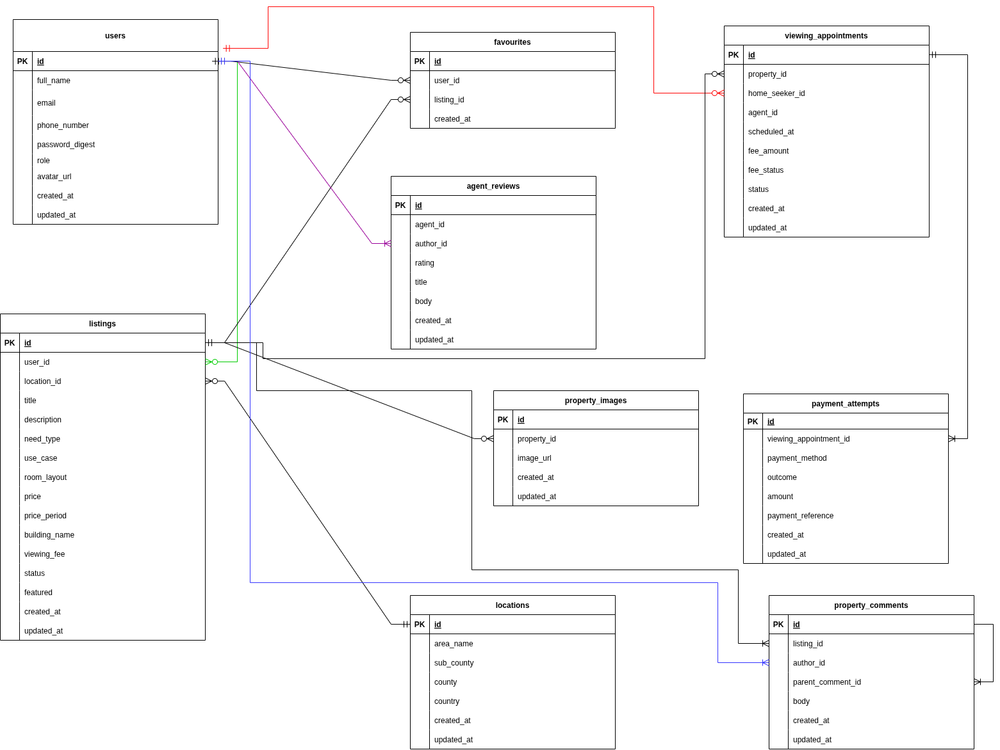

# README

## Tech Stack

- Ruby 3.3.0
- Rails 7.0.10

## Setup Instructions

```bash
$ git clone git@github.com:jameshmwangi/rafiki_house_hunter_app.git
$ cd rafiki_house_hunter_app
$ bundle install
$ rails db:create && rails db:migrate
$ rails s
```

## Catalog Design

[View Catalog Design](https://docs.google.com/spreadsheets/d/1_a6JiZ6Xu8AdPUmqbndPVV9HY6_A1AmmBom0mZ-VVAc/edit?usp=sharing)

## Table Definitions

[View Table Definitions](https://docs.google.com/spreadsheets/d/1_a6JiZ6Xu8AdPUmqbndPVV9HY6_A1AmmBom0mZ-VVAc/edit?usp=sharing)


## Wireframes

[View Wireframes](https://www.figma.com/design/SiU7c8cVkjiO08KDq4ynM1/Rafiki-HouseHunters-Wireframe?node-id=0-1&p=f)

[Wireframe Prototype View](https://www.figma.com/proto/SiU7c8cVkjiO08KDq4ynM1/Rafiki-HouseHunters-Wireframe?node-id=0-1&t=oc73q016QURKdqxE-1)


## ER Diagram



[View ER Diagram](https://drive.google.com/file/d/1uK_psI082Q64UfslzUuqqXONbdv41Iw4/view?usp=sharing)

## Screen Transitions


[View Screen Transitions](https://drive.google.com/file/d/1VF5qxMd46j2P22QMaqipmMcy0Io2juwm/view?usp=sharing)
